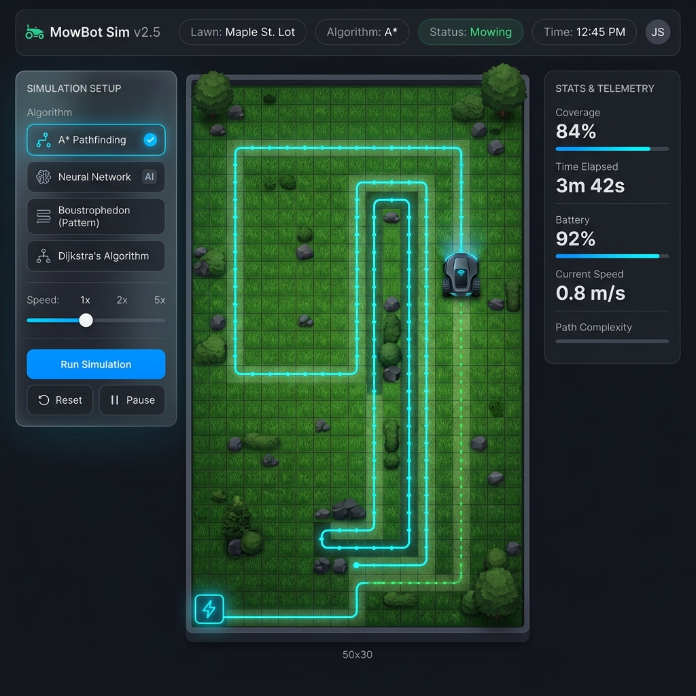

# 🚜 MowerAI: Autonomous Lawnmower Simulator

[](https://www.typescriptlang.org/)
[](https://reactjs.org/)
[](https://vitejs.dev/)
[](https://tailwindcss.com/)

**MowerAI** is a high-fidelity autonomous lawnmower simulation environment designed to test and visualize advanced pathfinding and coverage algorithms. From classic sweep patterns to evolved neural networks, MowerAI provides a robust playground for robotic navigation research and development.



---

## 🌟 Key Features

- **🤖 Autonomous Brains**: Switch between a wide array of navigation strategies, including a Genetic Algorithm-trained Neural Network.
- **⚡ Real-time Simulation**: Interactive grid environment with dynamic obstacle placement and mower state tracking.
- **🔋 Resource Management**: Realistic battery consumption logic and automated docking station return.
- **🌱 Environmental Impact**: Tracks lawn damage from excessive turning or over-mowing.
- **📊 Visual Metrics**: Heatmaps for visit counts and path visualization to analyze coverage efficiency.

---

## 🧠 Navigation Algorithms

MowerAI implements a comprehensive suite of algorithms categorized by their approach:

### 🧩 Coverage & Sweep
- **Boustrophedon (Sweep)**: Classic back-and-forth "ox-turning" pattern for systematic coverage.
- **Spiral Coverage**: Expanding outward from a center point to cover circular or open areas.
- **Spanning Tree Coverage (STC)**: Guaranteed 100% coverage using a grid-based Hamiltonian cycle.

### 🧬 AI & Heuristics
- **Neural Network (Evolved)**: A 46-input deep learning model evolved through genetic algorithms, utilizing raycasting vision and memory states.
- **Smart AI (Closest Grass)**: A greedy heuristic approach that always targets the nearest un-mowed patch.
- **Artificial Potential Fields (APF)**: Uses virtual physics—grass "pulls" the mower while obstacles "push" it away.

### 📍 Classic Pathfinding
- **A* & Dijkstra**: Optimal pathfinding between the mower and its target (grass or dock).
- **RRT (Rapidly-exploring Random Trees)**: Efficiently explores complex or tight spaces.
- **JPS (Jump Point Search)** & **D* Lite**: Incremental and optimized search variants for dynamic environments.

---

## 🚀 Getting Started

### Prerequisites
- [Node.js](https://nodejs.org/) (v18 or higher recommended)
- [npm](https://www.npmjs.com/)

### Installation

1. Clone the repository:
   ```bash
   git clone https://github.com/FDiskas/mowerai.git
   cd mowerai
   ```

2. Install dependencies:
   ```bash
   npm install
   ```

3. Start the development server:
   ```bash
   npm run dev
   ```

4. Open your browser to `http://localhost:5173` to see the simulator in action!

---

## 🛠️ Technical Stack

- **Core**: React 19, TypeScript
- **Styling**: Tailwind CSS 4.0
- **Build Tool**: Vite 8.0
- **AI/Logic**: Custom Neural Network implementation with Genetic Algorithm evolution logic.

---

## 📈 Roadmap

- [ ] Implementation of full Hamiltonian Cycle for STC.
- [ ] 3D Visualization using Three.js.
- [ ] Multi-mower swarm coordination.
- [ ] Real-world map data integration (OpenStreetMap).

---

Developed with ❤️ by [FDiskas](https://github.com/FDiskas)
